# suicide-analysis
### Contributors
+ Angie Cruz
+ Ana Juarez
+ Mariana Geoffroy
+ Ricardo Pérez
+ Samantha Sepulveda

### Our topic
After our time in lockdown (due to the Pandemic), there has been a new focus on mental health. We will analyze suicide rates relating socio-demographic factors, political factors, and economical factors such as: unemployment, birthrate, alcohol consumption, population, global terrorism, climate change and more. In these factors, we are confident to find positive correlations and explanations for the increase in suicide rates (maintaining a global focus). We hope that with our findings, we can bring more awareness to this serious subject and those who find themselves in this situation can seek treament and help.

### Data Recopilation
We used data from various resources such as world bank, our world in data, kaggle, and WHO. We hope that with this research, awareness can be raised so additional funding is done in welfare-state policies that may reduce the suicide rate mortality.

### Data Cleaning
The data was then cleaned through python to be able to merge all the databases together and have uniformity, as well as normalization between all variables.

### Exploration 
Data exploration was made through Tableau, in which we got an initial idea of the factors that would be impacted by suicide and a general consensus of the issue that was analyzed.

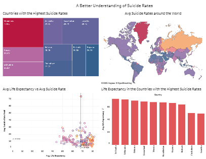

| Analysis |
| --- |
We then processed the data through machine learning using models such as : linear regression, logistic regression, random forest, and support vector machine.

Of course, there were differences in accuracy because not all models are fit for this kind of purpose: prediction. Some are general models to note relationship between data and other factors such as the data not being fit for the type of model caused faults in accuracy.

Beyond logical reasoning, we also found research that sustained: economical factors such as unemployment (before fitting the suicide rate), had a strong influence on the suicide mortality rate. Other factors we noticed with a strong relation was mental_substance_abuse and of course life_expectancy. 

An initial correlation was made in which we discovered the following:
+ Positive correlation 
  + suicide_rate_owid 1.000000 
  + mental_substance_disorders 0.146587 
  + death_rate 0.187283
+ Negative correlation 
  + life_expectancy -0.188927

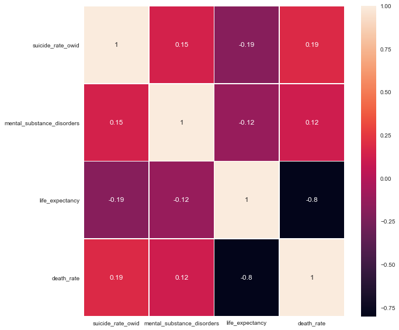
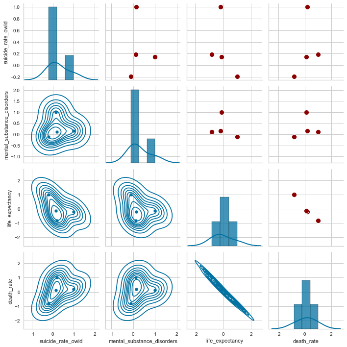

Of course, these correlations were to be expected, nevertheless we are a little dissapointed that they are lower than 0.4, which means they are not high enough to prove a strong relationship.

We then executed a linear model, in which we found low testing and training scores, as well as accuracy. This is because linear regressions are used for predictions (of two variables but not categorical ones), in which a logistical regression is the better fit.

+ Results 
  + Training Score: 0.06487984027546811 
  + Testing Score: 0.04915427513155979 
  + Accuracy: 0.049

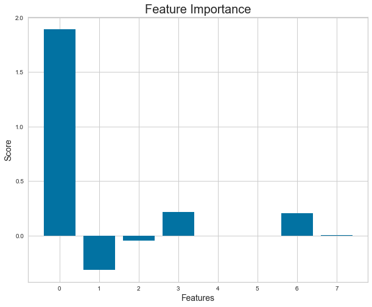
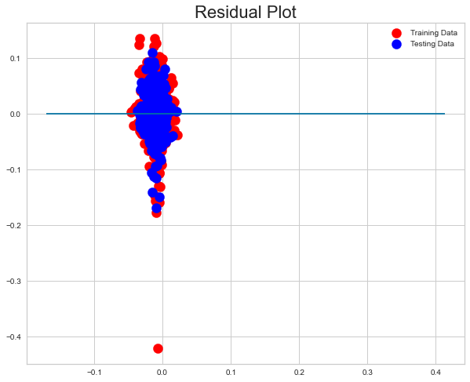

We also did a logistical regression in which it gaves us an accuracy of 70% for the model. We also plotted the relationship of unemployment vs suicide rate, and mental_abuse_substance vs suicide rate in scatter plots.

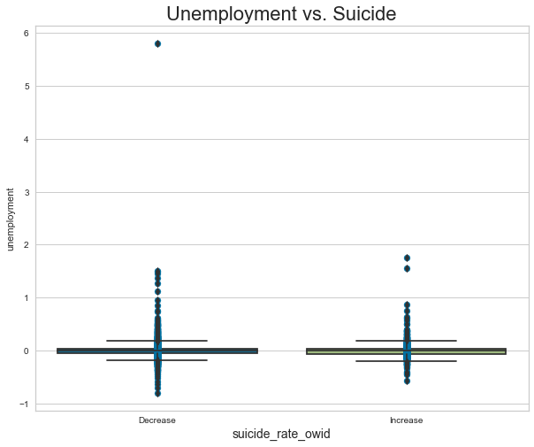
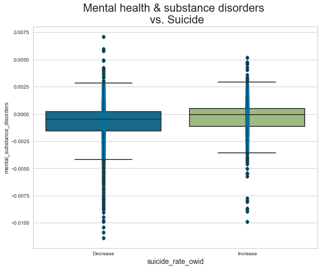

+ Results 
  + Accuracy：70.43% 
  + Recall：0.00% 
  + Precision：0.00% F1：0.00%

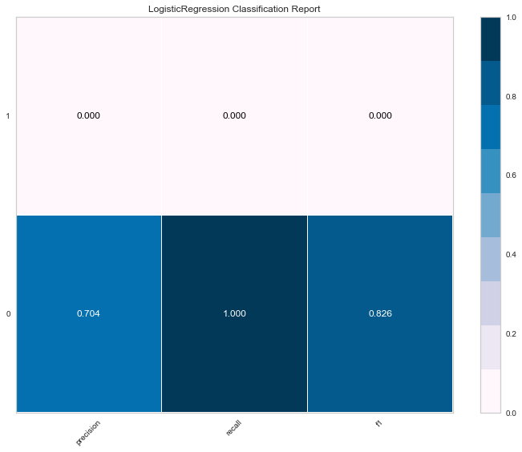
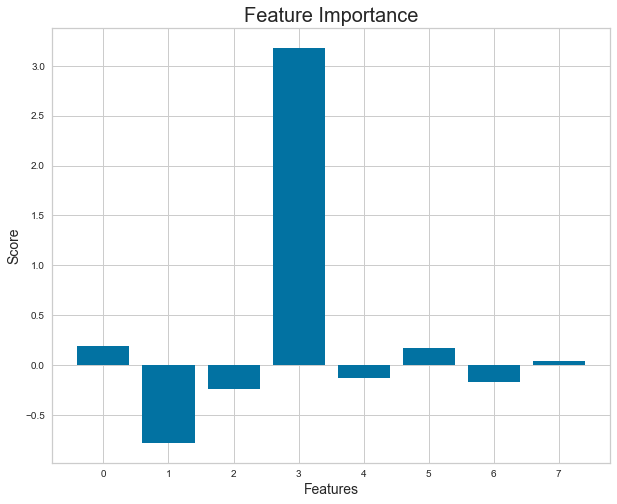

The next model we did was a random forest, in which we also got an accuracy of 73% but we got higher precisions and recall than the logistical model.

+ Results 
  + Training Data Score: 1.0 
  + Testing Data Score: 0.7364787111622555

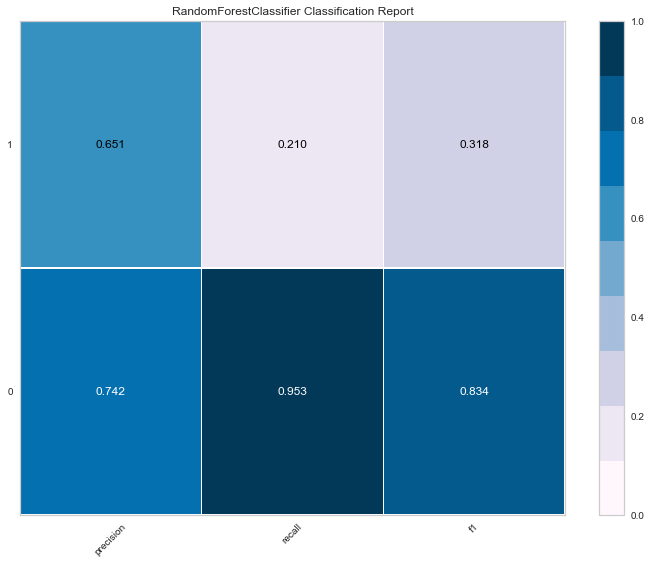
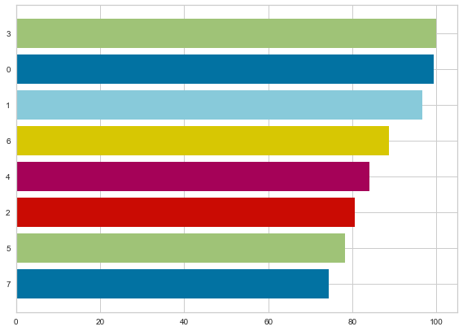

Other models we tested were the SVR and SVM. In the SVR we got negative test scores which means are prediction is not that great and the parameters were not a fit for the data. It is focused on continous values to know how tolerant we are of errors, while SVM is focused on classification values (like the ones we employed).

+ Results 
  + Training Score: -0.3901860777815773 
  + Testing Score: -0.6574555206324033

In the SVM we got good testing and training scores as well as an accuracy of 70.0%.
+ Results 
  + Accuracy：70.43% 
  + Recall：0.00% 
  + Precision：0.00% 
  + F1：0.00%

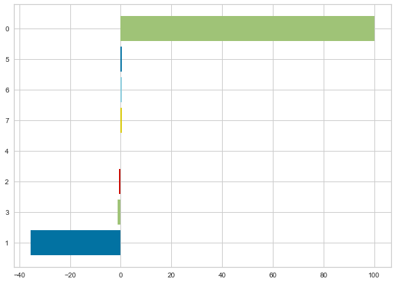

Another model we did was the neural network, which was a good model for our prediction. 
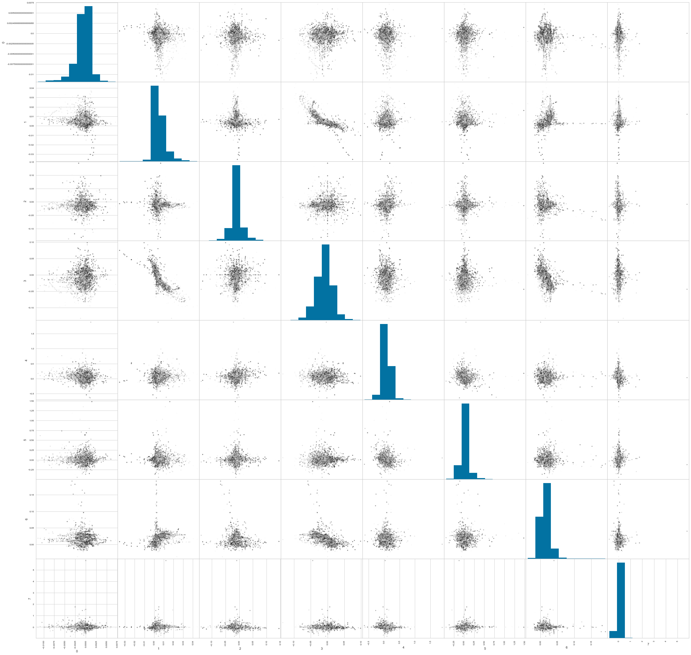

### Final Thoughts
In conclusion, SVM, Random Forest, and the Logistical Regression were the best fit for our data and our prediction (focus of study). We believe that this is an important cause that has increased during externalities such as the pandemic we are currently going through. Even though this is a difficult subject to bring forward (even when it comes to public policy), it is in our best interest that the awareness raised allows those found in this situation(and with the factors analyzed) to receive help.

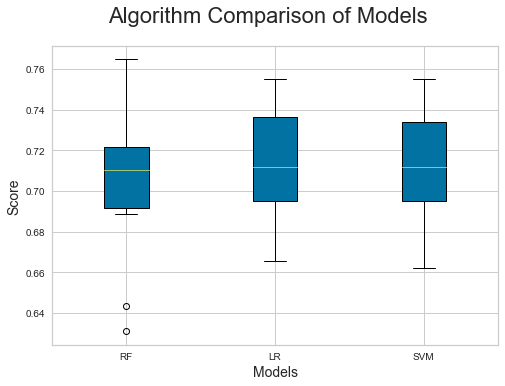

## Additional Notes
It was interesting to find that our correlation and accuracy results amongst all models decreased when we percent-changed (current vs previous year comparison) our data.

### Host Application
* [Heroku](https://suicide-proyect-ml.herokuapp.com/index.html)
